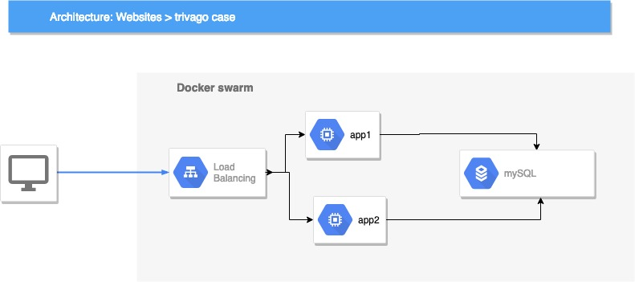

# Case Study for Trivago

## By [Pablo Serrano](https://pabloserrano.net) 

# How to running the enviroment

You need to install docker and execute in the main directory 

make init

For check the website: 

make test-web 

# Steps to the case study

- 
- Building docker image for web app. 

- Building register for upload all changes and all deploys. 

- I found problems with networks layers on Swarm and traefik.

- This is basic schema about tiny infraestructure. 

### Final Questions 

− How would you update a concrete artifact inside the web server layer?

Only made changes in the docker web image and i could get push to the register and update the cluster.

− How would you assure HA for the whole application?

I would use to place each replica on a different node in the docker swarm, minimizing the risk of a stopped node stopping the entire instance of the service.

− How would you improve your solution? Mention next steps to be considered.

I would like to have more time to do better solution for network layer (encript layer, https, etc)